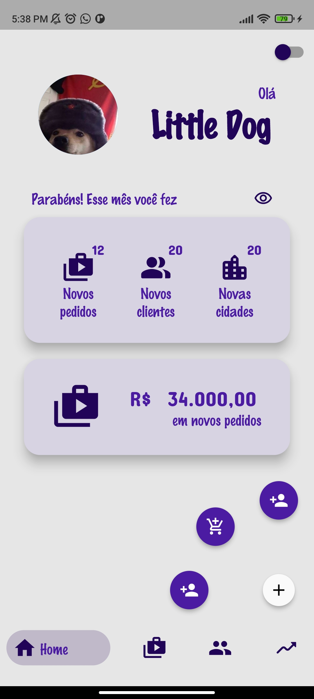
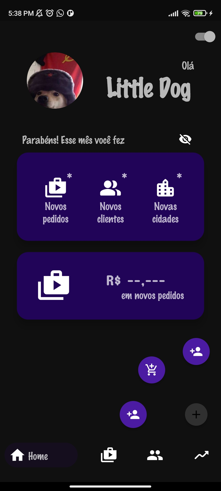
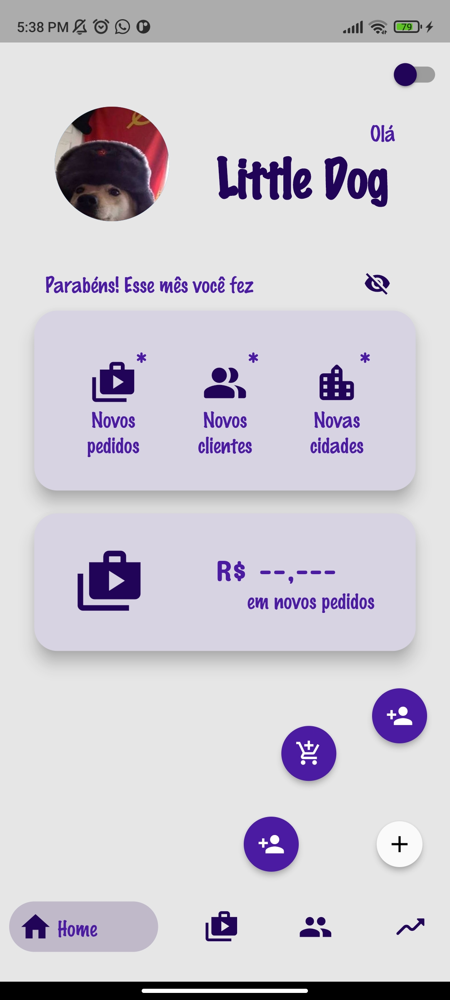

# Layout App

Desafio feito durante a matéria de Programação IV

# Link do repositório

[Link do repositório original](https://github.com/Brennez/Desafio-do-Layout)

## Tecnologias

- Flutter
- Dart

## ScreenShots

| Com dark mode                              | Light mode                                                  |
| ------------------------------------------ | ----------------------------------------------------------- |
|  |       |
| Com dark mode e hide                       | Light mode e hide                                           |
| --------------------------------------     | ----------------------------------------------------------- |
|     |          |
